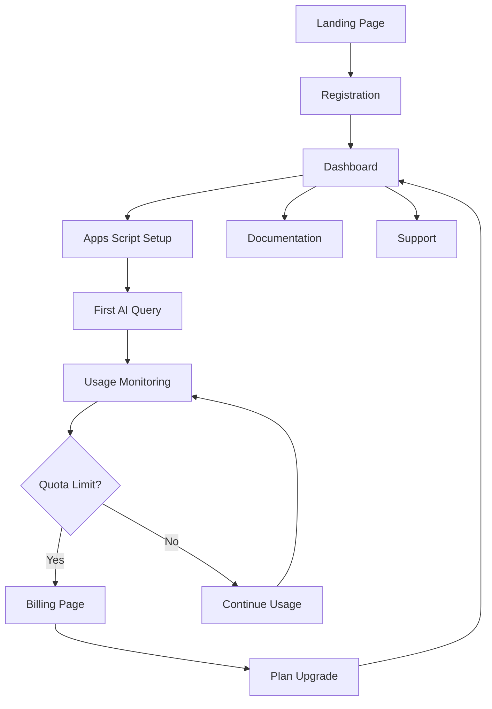

# Product Requirements Document (PRD)
## SpreadsheetAI: Platform AI untuk Google Sheets & Excel

**Versi**: 1.0  
**Tanggal**: 25 September 2025  
**Product Manager**: Technical Team  
**Status**: Final Draft  

---

## 1. Product Overview

SpreadsheetAI adalah platform AI yang memungkinkan pengguna mengakses kemampuan AI langsung di Google Sheets dan Microsoft Excel melalui formula custom seperti `=AI("prompt")`. Platform ini dirancang khusus untuk pasar Indonesia dengan competitive advantage berupa biaya operasional 90% lebih rendah dari kompetitor seperti Numerous.ai.

Platform ini memecahkan masalah utama UMKM Indonesia dalam mengakses teknologi AI yang mahal, dengan menyediakan solusi yang terintegrasi langsung dengan tools yang sudah familiar. Target market utama adalah 64+ juta UMKM Indonesia yang menggunakan spreadsheet untuk operasional bisnis harian.

Target revenue $120K+ ARR dalam 18 bulan dengan sustainable competitive moat melalui efisiensi teknologi dan fokus pada pasar lokal Indonesia.

## 2. Core Features

### 2.1 User Roles

| Role | Registration Method | Core Permissions |
|------|---------------------|------------------|
| Free User | Email registration | 10,000 tokens/bulan, Google Sheets only, basic AI models |
| Starter User | Upgrade dengan payment | 1M tokens/bulan, semua AI models, priority support |
| Professional User | Upgrade dengan payment | 5M tokens/bulan, Excel integration, team features |
| Business User | Upgrade dengan payment | 20M tokens/bulan, custom models, audit logs |
| Enterprise User | Custom contract | Unlimited tokens, on-premise, SLA, dedicated support |

### 2.2 Feature Module

Platform SpreadsheetAI terdiri dari halaman-halaman utama berikut:

1. **Landing Page**: hero section dengan value proposition, pricing comparison, demo video, testimonials
2. **Dashboard Page**: usage statistics, API key management, billing information, performance metrics
3. **Documentation Page**: setup guide, function reference, troubleshooting, video tutorials
4. **Billing Page**: subscription management, payment history, usage alerts, plan comparison
5. **Support Page**: help center, contact form, community forum, knowledge base

### 2.3 Page Details

| Page Name | Module Name | Feature Description |
|-----------|-------------|---------------------|
| Landing Page | Hero Section | Display value proposition dengan cost comparison 90% lebih murah, demo video integration |
| Landing Page | Pricing Section | Show freemium model dengan clear upgrade path, pricing dalam IDR dan USD |
| Landing Page | Demo Section | Interactive demo dengan real Google Sheets integration |
| Dashboard Page | Usage Analytics | Real-time tracking tokens used, queries processed, cost savings calculation |
| Dashboard Page | API Management | Generate, revoke, monitor API keys dengan usage statistics |
| Dashboard Page | Performance Metrics | Response time indicators, success rates, cache hit notifications |
| Documentation Page | Setup Guide | Step-by-step Google Sheets Apps Script installation dengan troubleshooting |
| Documentation Page | Function Reference | Complete documentation untuk =AI(), =AI_BATCH(), =AI_TRANSLATE() functions |
| Documentation Page | Video Tutorials | Embedded YouTube tutorials dalam Bahasa Indonesia |
| Billing Page | Subscription Management | Upgrade/downgrade plans, payment methods, billing history |
| Billing Page | Usage Alerts | Configure notifications untuk quota limits, overage warnings |
| Support Page | Help Center | FAQ, common issues, best practices dalam Bahasa Indonesia |
| Support Page | Community Forum | User discussions, use case sharing, peer support |

## 3. Core Process

### User Flow - Free User Registration
1. User mengunjungi landing page dan melihat demo
2. User mendaftar dengan email/password (30 detik)
3. User menginstall Google Apps Script add-on (2 menit)
4. User generate API key dan test connection (1 menit)
5. User mencoba first AI query dengan guided tutorial (2 menit)
6. User menerima welcome email dengan advanced tutorials

### User Flow - Paid User Upgrade
1. Free user mencapai quota limit atau butuh advanced features
2. User melihat upgrade notification di dashboard
3. User memilih plan yang sesuai di billing page
4. User melakukan payment dengan local payment methods
5. User mendapat akses immediate ke advanced features
6. User menerima onboarding email untuk new features

## 4. User Interface Design

### 4.1 Design Style

- **Primary Colors**: #2563EB (Blue), #10B981 (Green untuk success states)
- **Secondary Colors**: #64748B (Gray), #F59E0B (Orange untuk warnings)
- **Button Style**: Rounded corners (8px), subtle shadows, hover animations
- **Font**: Inter untuk headings, system fonts untuk body text
- **Layout Style**: Clean card-based design, top navigation dengan sidebar untuk dashboard
- **Icons**: Heroicons untuk consistency, Indonesian flag emoji untuk local touch

### 4.2 Page Design Overview

| Page Name | Module Name | UI Elements |
|-----------|-------------|-------------|
| Landing Page | Hero Section | Large heading dengan cost comparison badge, animated demo video, CTA button dengan Indonesian text |
| Landing Page | Pricing Cards | 3-column layout dengan popular plan highlighted, IDR pricing prominent, feature comparison table |
| Dashboard Page | Usage Dashboard | Progress bars untuk quota usage, real-time counters, cost savings calculator dengan rupiah format |
| Dashboard Page | API Management | Copy-to-clipboard API key field, connection status indicator, usage graphs |
| Documentation Page | Setup Guide | Step-by-step cards dengan screenshots, progress indicator, troubleshooting accordion |
| Billing Page | Payment Form | Local payment methods (GoPay, OVO, Bank Transfer), secure payment badges |

### 4.3 Responsiveness

Desktop-first design dengan mobile-adaptive layout. Touch interaction optimization untuk mobile users, dengan special attention pada Indonesian mobile usage patterns. Sidebar navigation collapses to hamburger menu pada mobile devices.
